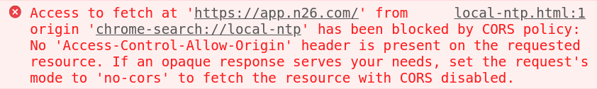

# Cross-Origin Resource Sharing (CORS)

[Documentation on MDN](https://developer.mozilla.org/en-US/docs/Web/HTTP/CORS)

Grant access to resources on a different origin, applies to:

* `fetch` and `XMLHttpRequest`
* `@font-face`
* WebGL textures
* Images and video frames in canvas
* CSS Shapes from images

```txt
┌───────────────┐   same-origin
│               │ ────────────────▶  example.com/styles.css
│    Website    │
│  example.com  │
│               │ ────────────────▶  cdn.com/scripts.js
└───────────────┘   cross-origin
```

## Example

### Block all cross-origin requests

No `Access-Control-Allow-Origin` specified.

```js
fetch('https://app.n26.com')
```



### Allow requests from specific origin

`Access-Control-Allow-Origin: https://example.com`

### Allow all cross-origin requests

`Access-Control-Allow-Origin: *`

```js
fetch('https://cdn.jsdelivr.net/npm/vue')
```
